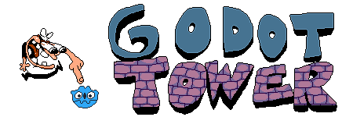

# Godot Tower

Godot Tower is a work-in-progress rewrite of Pizza Tower (SAGE 2019 demo) in Godot Engine (3.x).

## Info

The current goal of Godot Tower is to recreate the Pizza Tower SAGE 2019 demo in Godot Engine as accurately as possible. This is done by taking the demo's code and rewriting it in GDScript.
Rewriting the original GML code in GDScript means that the game plays very similarly to the actual game, however it will never be 100% accurate to the original due to how differently Godot works compared to GameMaker.

In its current state, while it does work and is playable, it is very buggy and unfinished, primarily due to certain functionality being incomplete and simply because Godot works differently from GameMaker.

## Credits

I do not own and didn't make any of the assets and music that are used in this project.

* Pizza Tower is made by Tour De Pizza. (McPig and Sertif)
* Pizza Tower's composers are: Mr. Sauceman, ClascyJitto and POST ELVIS.

If you don't own Pizza Tower on Steam yet, you can support the developers by buying the game.  
Come on, just [buy the game](https://store.steampowered.com/app/2231450/Pizza_Tower/)! You know you want it!

The following projects are used, which are both licensed under the MIT License:

* [Godot Palette Swap Shader (Godot 3.x version)](https://github.com/KoBeWi/Godot-Palette-Swap-Shader/tree/3.x)
* [BitmapTextureFont](https://github.com/Digital-Sin/BitmapTextureFont)

The licenses for these projects can be found in their respective folders.